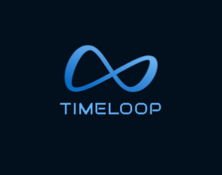

# TimeLoop ⌛

A beautiful and intuitive time tracking and mood journaling application that helps you monitor your daily activities, track your goals, and maintain a healthy work-life balance.

## Features 🌟

- **Memory Tracking**: Log your daily activities and thoughts with mood indicators
- **Goal Management**: Set and track your personal and professional goals
- **Pomodoro Timer**: Stay focused with a built-in Pomodoro timer
- **Insightful Reports**: Visualize your progress with beautiful charts and analytics
- **Dark Mode**: Easy on the eyes with automatic dark mode support
- **Weather Integration**: Automatic weather information for your entries
- **Discord Integration**: Share your positive memories to Discord
- **PWA Support**: Install as a Progressive Web App
- **Data Export/Import**: Backup and restore your data

## Use 🚀
 
- **Visit**: https://Timeloop.pages.dev or https://Timeloop.vercel.app for web use

## Technologies Used 💻

- HTML5, CSS3, JavaScript
- Chart.js for data visualization
- Local Storage for data persistence
- Service Workers for PWA functionality
- OpenWeatherMap API for weather data
- Discord Webhooks for sharing memories

## Creator 👨‍💻

Developed by [prakit1234 (Kaii)](https://github.com/prakit1234) with ❤️

## Contributing 🤝

Contributions, issues, and feature requests are welcome! Feel free to check the [issues page](https://github.com/prakit1234/timeloop/issues).

## License 📝

This project is licensed under the MIT License - see the [LICENSE](LICENSE) file for details.

## Support 💪

If you like this project, please give it a ⭐️! 